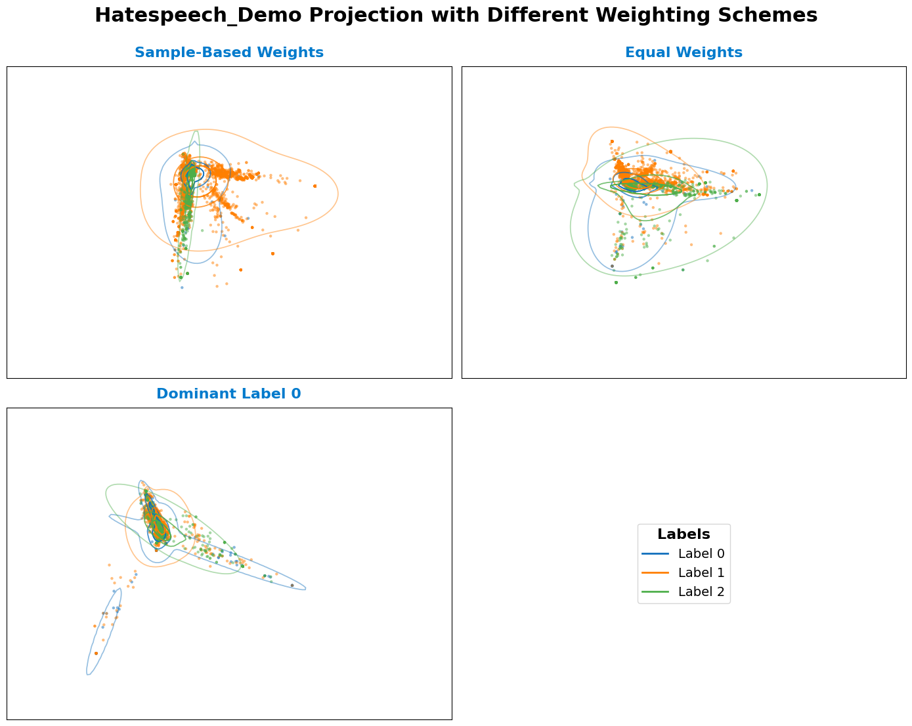
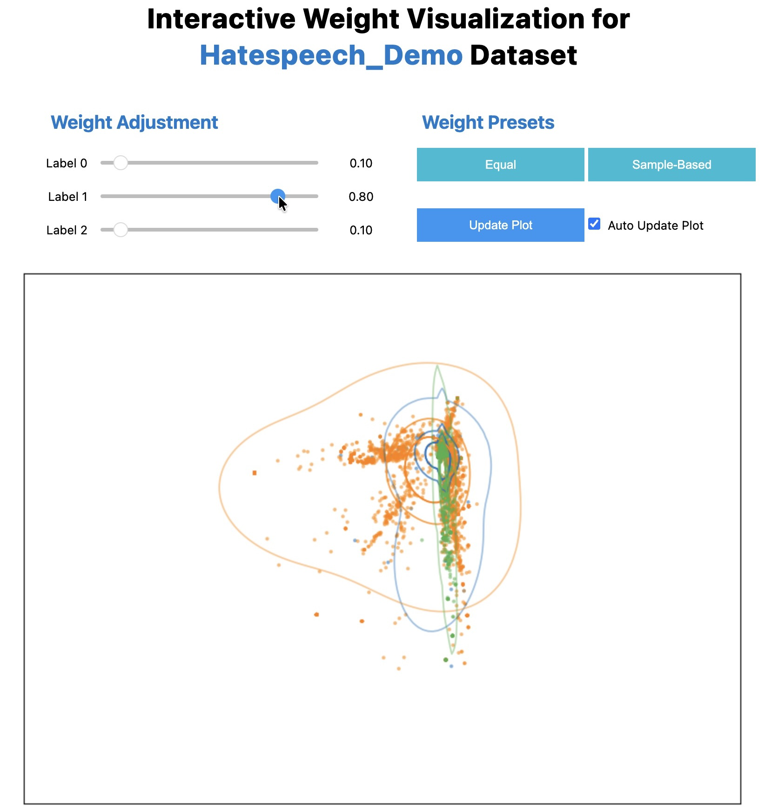

<h1 align="center">Weighted Gaussian Mixture Modeled Uncertainty-Aware PCA</h1>

---

## ✨ Overview

This repository provides the core implementation of [*Uncertainty-Aware PCA for Arbitrarily Distributed Data Modeled by Gaussian Mixture Models*](https://arxiv.org/abs/2508.13990) by Klötzl et al. [[1]](#1). It contains the main code components to reproduce the results and visualizations used in the associated publication.

The key features of this repository include:

- Implementation of WGMM-UAPCA for label-aware low-dimensional projections
- Interactive exploration of label weighting
- Reproduction of quantitative evaluation from Espadoto et al. [[2]](#2) datasets

The content is structured as follows:

```bash
wGMM-UAPCA/
├─ wgmm_uapca/
│   ├─ __init__.py
│   ├─ utils.py                     # Dataset loading, preprocessing, helper functions
│   ├─ visualizations.py            # Plotting and visualization functions
│   └─ wgmm_uapca.py                # Core functions for projection computation
│
├─ data/
│   ├─ datasets/                    # Datasets described by Espadoto et al. (will be downloaded automatically by either notebooks)
│      ├─ bank/
│         ├─ X.csv.gz
│         └─ y.csv.gz
│      ├─ cifar10/
│         ├─ X.csv.gz
│         └─ y.csv.gz
│      └─ ...
│   └─ gmm_components.json          # Precomputed GMM parameters for datasets
│
├─ results/                         # Evaluation results, projection images, and computed measures (will be generated by eval_espadoto.ipynb)
│   ├─ bank/
│         ├─ bank_pca.png
│         ├─ bank_uapca.png
│         └─ bank_wgmm-uapca.png
│   ├─ cifar10/
│         ├─ cifar10_pca.png
│         ├─ cifar10_uapca.png
│         └─ cifar10_wgmm-uapca.png
│   └─ ...
│   └─ measures.csv
│
├─ demo.ipynb                       # Step-by-step example: projections & weighting schemes
├─ eval_espadoto.ipynb              # Evaluation notebook
│
├─ .gitignore
├─ LICENSE
├─ README.md
└─ requirements.txt
```

> Note: If not already present, datasets listed in `data/datasets/` are downloaded from the original source by Espadoto et al. [[2]](#2) when running either notebooks for the first time. Precomputed GMM parameters are provided in `gmm_components.json`.

## ⚙️ Usage

This code was tested on Python 3.11 with the dependencies listed in requirements.txt.

Install dependencies via:

```bash
pip install -r requirements.txt
```

## 🧩 Run the Demo


The demo notebook `demo.ipynb` provides a step-by-step walkthrough of how to use **weighted Gaussian mixture modeled uncertainty-aware PCA (wGMM-UAPCA)** for projecting Gaussian mixture modeled data and exploring their weight-sensitivity.

It consists of:
1. Importing the main library and required packages  
2. Loading a dataset (e.g., `hatespeech_demo`)  
3. Fitting Gaussian Mixture Models (GMMs) for each label  
4. Exploring different weighting schemes  
5. Visualizing 2D projections with density contours  
6. Interactively adjusting label weights


The default dataset is `hatespeech_demo`, which is identical to the original hatespeech dataset but fitted with different random seeds to produce distinct GMMs for clearer visual comparison.  
You can switch to any other dataset (e.g. `bank`, `cifar10`, `fashion_mnist`, etc.) described in Espadoto et al. [[2]](#2) by changing:
```python
dataset_name = "hatespeech_demo"
```
Each weighting scheme highlights different aspects of the data:
- **Sample-Based Weights:** proportional to label frequency
- **Equal Weights:** uniform across labels
- **Dominant Label 0:** label 0 emphasized

The resulting projections, shown below, illustrate how label weighting alters the 2D embedding and mixture structure.


*Projection of `hatespeech_demo` using different weighting schemes.*

The notebook concludes with an **interactive visualization**, where sliders control label weights in real time.  
Weights are automatically normalized, and users can toggle *Auto Update* or reset to *Equal* or *Sample-Based* presets. 


*Interactive visualization of `hatespeech_demo` projection. Use sliders to adjust label weights and see the projection update interactively.*

## 🧠 Evaluate Results

The notebook `eval_espadoto.ipynb` reproduces the quantitative evaluation from the related publication using the real-world datasets described by Espadoto et al. [[2]](#2).  
Due to minor system-dependent differences in randomness and sampling (used in fast sliced Wasserstein distance computations), results may slightly vary from those reported in the paper. The results in the paper were obtained using a MacBook Pro with Apple M4 Pro chip and 24 GB RAM using **Python 3.11.13** and the dependencies listed in `requirements.txt`.  
All computed results are saved in results/measures.csv for further analysis.

## 📖 References

<a id="1">[1]</a> Daniel Klötzl, Ozan Tastekin, David Hägele, Marina Evers, and Daniel Weiskopf,
"Uncertainty-Aware PCA for Arbitrarily Distributed Data Modeled by Gaussian Mixture Models," in Uncertainty Visualization: Unraveling Relationships of Uncertainty, AI, and Decision-Making, 2025, doi: [arXiv.2508.13990](https://doi.org/10.48550/arXiv.2508.13990).  
<a id="2">[2]</a> M. Espadoto, R. M. Martins, A. Kerren, N. S. T. Hirata and A. C. Telea, "Toward a Quantitative Survey of Dimension Reduction Techniques," in IEEE Transactions on Visualization and Computer Graphics, vol. 27, no. 3, pp. 2153-2173, 2021, doi: [10.1109/TVCG.2019.2944182](https://doi.org/10.1109/TVCG.2019.2944182).

## 👤 Authors

This repository is maintained by:

- **Daniel Klötzl** - [@visdan93](https://github.com/visdan93)
- **Ozan Tastekin** - [@draaven](https://github.com/Draaven)
- **David Hägele** - [@hageldave](https://github.com/hageldave)
- **Marina Evers** - [@marinaevers](https://github.com/marinaevers)

## 🪪 License

Copyright 2025 Daniel Klötzl, Ozan Tastekin, David Hägele and Marina Evers

Licensed under the Apache License, Version 2.0 (the "License"); you may not use this file except in compliance with the License. You may obtain a copy of the License at

<http://www.apache.org/licenses/LICENSE-2.0>

Unless required by applicable law or agreed to in writing, software distributed under the License is distributed on an "AS IS" BASIS, WITHOUT WARRANTIES OR CONDITIONS OF ANY KIND, either express or implied. See the License for the specific language governing permissions and limitations under the License.
